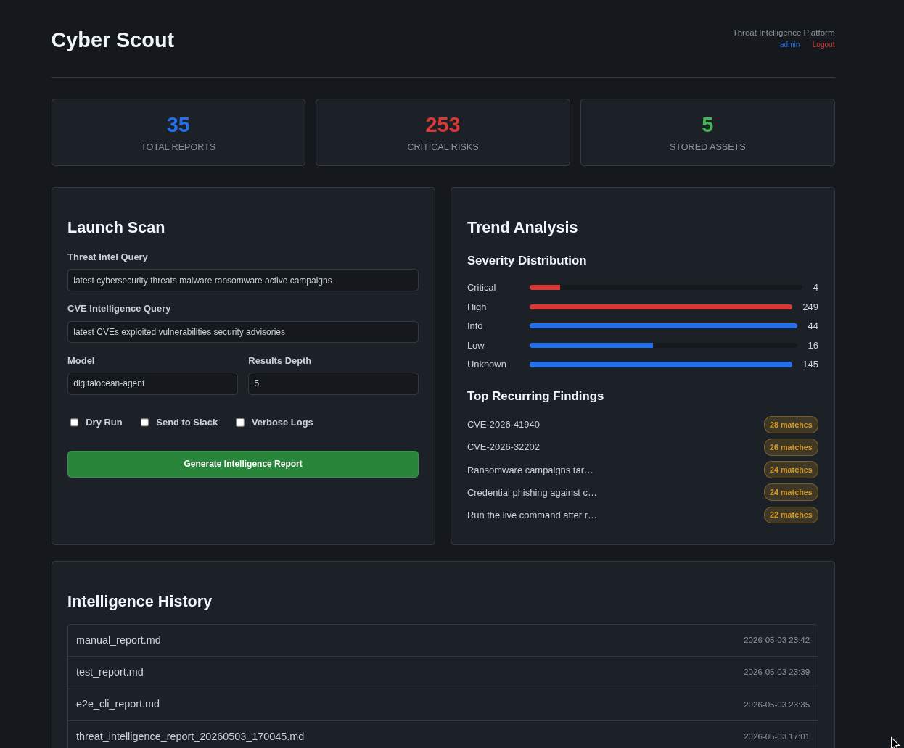
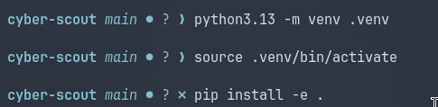
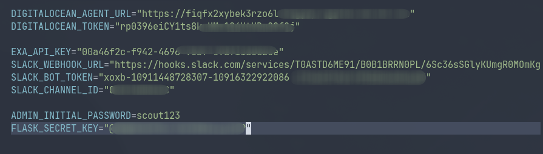
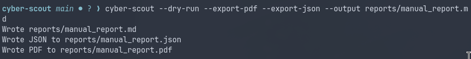
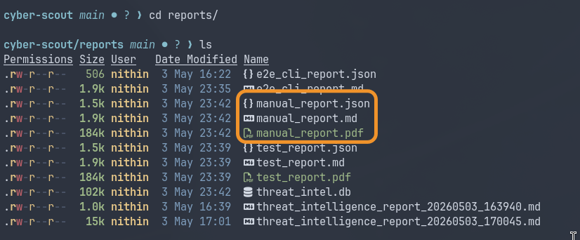
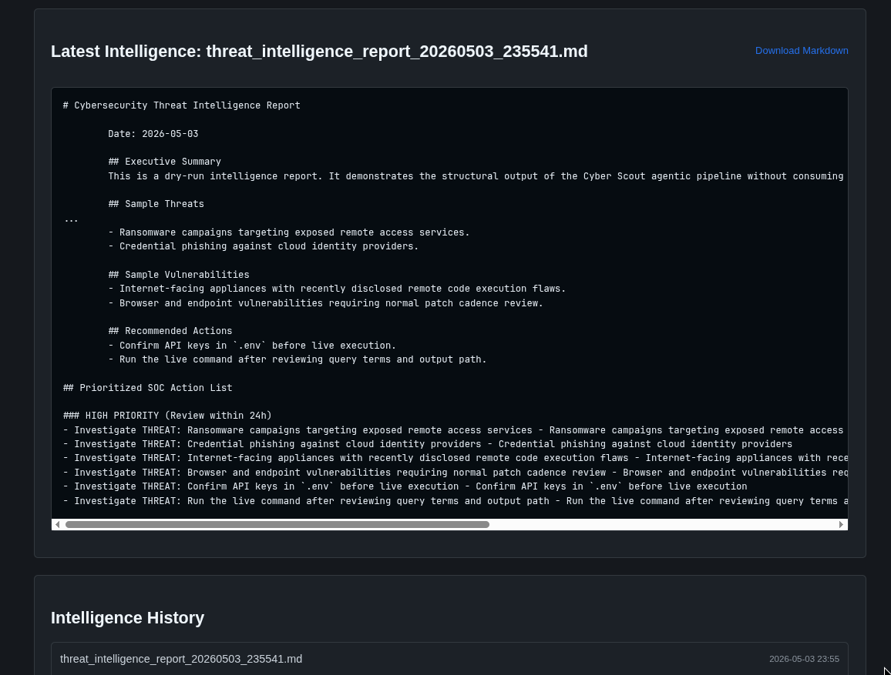
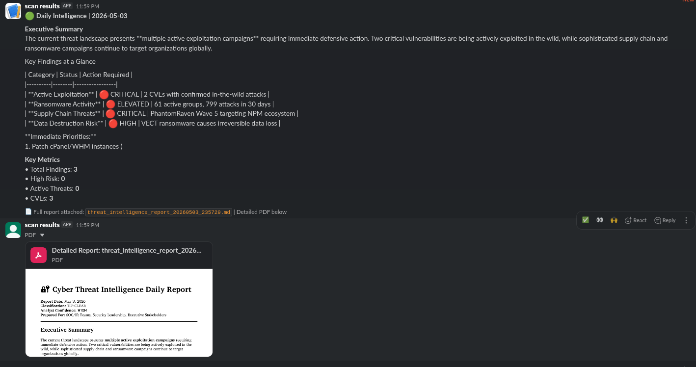

# Cyber Scout: AI-Powered Cybersecurity Threat Intelligence

Cyber Scout is an automated threat intelligence pipeline that leverages multi-agent AI (CrewAI) and DigitalOcean AI Agents to hunt, analyze, and report on emerging cyber threats and vulnerabilities.


*Figure: Cyber Scout Dashboard featuring trend analytics, risk distribution, and automated scanning.*

## Key Features

- Multi-Agent Analysis: Dedicated AI agents for threat analysis, vulnerability research, and incident response.
- Automated Scheduling: Daily intelligence reports via cron or internal scheduler.
- Web Dashboard: Visual analytics, trend tracking, and historical report management.
- Multi-Format Export: Generates professional reports in Markdown, JSON, and PDF.
- Slack Integration: Real-time alerts and full report uploads to Slack channels.
- IOC Extraction: Automatically extracts and scores Domains, IPs, and CVEs.

---

## Prerequisites and Integration Setup

To use Cyber Scout, you need to set up the following external services:

### 1. DigitalOcean AI Agent
Cyber Scout uses DigitalOcean's Agent Platform for high-performance AI orchestration.
- Setup Guide: [How to Create Agents on DigitalOcean AI Platform](https://docs.digitalocean.com/products/gen-ai-platform/how-to/create-agents/)
- What you need: DIGITALOCEAN_TOKEN and the DIGITALOCEAN_AGENT_URL.

### 2. Exa AI (Search Engine)
Exa provides the real-time web intelligence data.
- Website: [Exa.ai](https://exa.ai)
- What you need: EXA_API_KEY.

### 3. Slack Integration
- Incoming Webhooks: Required for formatted text reports.
  - Setup Guide: [Sending messages using Incoming Webhooks](https://api.slack.com/messaging/webhooks)
  - What you need: SLACK_WEBHOOK_URL.
- Bot Token: Required for uploading PDF reports to Slack.
  - Setup Guide: [Uploading files to Slack](https://api.slack.com/messaging/files/uploading)
  - Required Scopes: files:write, chat:write.
  - What you need: SLACK_BOT_TOKEN (starts with xoxb-) and SLACK_CHANNEL_ID.

## Project Capabilities

Cyber Scout transforms raw web data into actionable cybersecurity intelligence through its autonomous agent pipeline:

- **Autonomous Threat Hunting**: Uses AI to scour the web for the latest ransomware TTPs (Tactics, Techniques, and Procedures), zero-day exploits, and emerging malware campaigns.
- **Deep Vulnerability Analysis**: Beyond just listing CVEs, the system analyzes exploitability, assesses risk based on your tech stack, and identifies "in-the-wild" activity.
- **Automated SOC Playbooks**: For every identified threat, the Incident Response Advisor agent generates prioritized SOC actions, defensive strategies, and IOC lists.
- **Executive and Technical Reporting**: Generates multi-layered reports suitable for both C-suite executives (summaries) and SOC analysts (technical details and IOCs).
- **Historical Trend Tracking**: The built-in database and dashboard allow teams to track recurring threats and monitor the risk landscape over time.

---

## Sample Results

The following outputs demonstrate the depth and format of the intelligence Cyber Scout provides:

### 1. Real-Time Slack Alerts
Delivers a high-signal summary of findings directly to your team's communication channel, including risk scores and critical alerts.
- **View Sample**: [Slack Formatted Output](evidence/04_results/01_slack_formatted_output.png)

### 2. Professional PDF Reports
Generated for executive briefings and archival. These reports include cited sources, detailed analysis, and a structured SOC action plan.
- **Download Sample**: [Technical PDF Report](evidence/04_results/02_pdf_report_sample.pdf)

### 3. Machine-Readable Intelligence
Exports findings in JSON format, enabling seamless integration with other security tools like SIEMs (Splunk, Sentinel) or SOAR platforms.
- **View Sample**: [JSON Export Preview](evidence/02_cli/04_json_report_preview.png)

### 4. Interactive Trend Dashboard
A bird's-eye view of your organization's threat landscape, highlighting total reports, risk severity distribution, and top recurring threats.
- **View Sample**: [Dashboard Analytics](evidence/03_dashboard/03_main_analytics_view.png)

---

## Workflow Showcase

Cyber Scout follows a structured pipeline from setup to delivery.

### Phase 1: Environment and Setup
The run_daily_report.sh script automates the environment preparation on any Linux distribution.
| Step 1.1: Automated Setup | Step 1.2: API Configuration |
|:---:|:---:|
|  |  |
| *Running --setup to prepare Python and venv.* | *Configuring the .env file with your API keys.* |

### Phase 2: Intelligence Gathering (CLI)
The CLI orchestrates the AI agents to hunt for threats and vulnerabilities.
| Step 2.1: CLI Execution | Step 2.2: Local Results |
|:---:|:---:|
|  |  |
| *The AI agent pipeline in action.* | *Reports organized by timestamp in /reports.* |

### Phase 3: Monitoring and Analytics (Dashboard)
Use the web dashboard to track trends and deep-dive into historical intelligence.
| Step 3.1: Trend Analytics | Step 3.2: Detailed Report View |
|:---:|:---:|
|  |  |
| *Visualizing risk and recurring threats.* | *Inspecting individual run findings and SOC actions.* |

### Phase 4: Automation and Delivery
Set it and forget it with cron-based scheduling and instant Slack notifications.
| Step 4.1: Cron Scheduling | Step 4.2: Slack Delivery |
|:---:|:---:|
|  |  |
| *Automating daily runs via crontab.* | *Real-time intelligence delivered to your team.* |

---

## Installation

### Quick Start (Linux)
```bash
# 1. Setup the environment
./run_daily_report.sh --setup

# 2. Schedule daily reports (e.g., at 08:00 AM)
./run_daily_report.sh --schedule 08:00

# 3. Run manually
./run_daily_report.sh --run
```

---

## Usage

### Running the CLI
```bash
cyber-scout --send-slack --export-pdf --export-json
```

### Running the Dashboard
```bash
cyber-scout-dashboard
```
*Access at http://127.0.0.1:8501 (Default Login: admin / scout123)*

---

## How it Works
1. Intelligence Retrieval: Exa fetches live threat data.
2. AI Analysis: Multi-agent CrewAI pipeline (Analyst, Researcher, Advisor).
3. Persistence: Saves to SQLite and local files.
4. Delivery: Automated Slack alerts and PDF uploads.

---

## Python Compatibility
Supports Python 3.10, 3.11, 3.12, 3.13.

---

## License
MIT License. See [LICENSE](LICENSE) for details.
